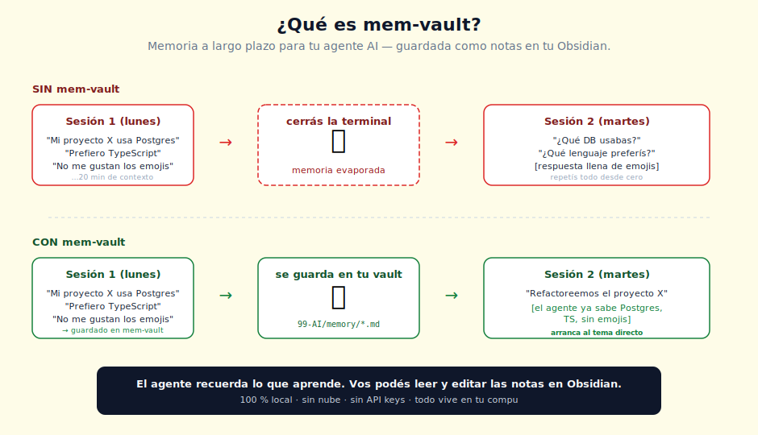

# Overview ejecutivo

> **mem-vault es memoria a largo plazo para tu agente AI.** Le da la
> capacidad de recordar — entre sesiones, entre días, entre proyectos —
> sin tener que repetirle todo desde cero cada vez.

Si querés el deep-dive técnico con todos los flujos y decisiones, andá a
[`architecture.md`](architecture.md). Esto es el resumen ejecutivo:
qué hace, para qué sirve, cómo se ve usándolo. **Sin tecnicismos.**

---

## El problema que resuelve

Hoy los agentes AI (Devin, Claude Code, Cursor, ChatGPT, lo que uses)
tienen un problema: **se olvidan de todo cuando cerrás la conversación.**

Cada sesión empieza desde cero. Si en la sesión del lunes le contaste:

> "Mi proyecto usa Postgres, prefiero TypeScript, no me pongas emojis."

El martes tenés que repetirlo todo. Si trabajás con un agente AI todos
los días, son 5-15 minutos diarios re-explicando el contexto que ya
explicaste mil veces.



---

## Qué hace mem-vault

Le agrega al agente una memoria a largo plazo — pero esa memoria vive
**como notas comunes en tu vault de [Obsidian](https://obsidian.md)**.

Cuando el agente aprende algo importante de vos (una preferencia, una
decisión, una convención del código, un descubrimiento), lo guarda
como un archivo `.md` en tu vault. La próxima vez que abra una sesión,
tiene acceso a todo lo que aprendió antes.

**Lo que el agente ve**: una memoria persistente que sobrevive
sesiones, terminales, días, proyectos.

**Lo que vos ves**: notas de markdown en Obsidian que podés leer,
editar, taggear, linkear, sincronizar con iCloud, commitear a git.

---

## Para quién es

- **Sí, te sirve si...**
  - Usás un agente AI todos los días y te cansa repetir contexto.
  - Tenés Obsidian (o estás dispuesto a tenerlo) y te gusta la idea
    de que el agente comparta tu vault.
  - Te importa que tus datos sean **tuyos** — local-first, sin cloud,
    sin API keys de OpenAI/Anthropic/etc.
  - Trabajás en varios proyectos y querés que el agente filtre la
    memoria por proyecto sin mezclar contextos.

- **Probablemente NO te sirve si...**
  - Sólo usás AI ocasionalmente (es overkill para el chat random).
  - No querés instalar nada local (mem-vault corre en tu compu).
  - Necesitás que la memoria se comparta entre múltiples humanos
    en una org (mem-vault es single-user por diseño; hay otras
    herramientas para teams).

---

## Cómo se ve en la práctica

Un día normal trabajando con [Devin](https://docs.devin.ai/cli) +
mem-vault instalado:

### 1. Abrís una nueva sesión

```
$ devin

✓ MCP server "mem-vault" loaded
✓ 87 memorias indexadas en este vault

[Memorias relevantes inyectadas al contexto del agente]
```

El agente ya **sabe** cosas como "Fer prefiere voseo argentino", "el
proyecto rag-local usa sqlite-vec", "no le gustan los emojis" — sin
que vos hayas dicho nada esta sesión.

### 2. Empezás a trabajar

Le pedís: *"Refactoreemos el módulo de retrieval"*. El agente NO te
pregunta qué proyecto, qué stack, qué convenciones. Va directo al
grano porque ya tiene el contexto.

### 3. El agente aprende algo nuevo

A mitad de la sesión, el agente descubre un patrón importante:
*"Cuando uso este wrapper de Ollama tengo que setear `OLLAMA_HOST`
explícitamente, sino se cuelga en IPv6."*

El agente llama a `memory_save`. Se crea automáticamente
`99-AI/memory/ollama_python_lib_se_cuelga_con_127_0_0_1.md` en tu
vault con frontmatter limpio y body markdown.

### 4. Cerrás la sesión

Cuando el turno termina, mem-vault detecta qué memorias citó el
agente en su respuesta (busca `[[wikilinks]]`) y bumpea el contador
de "esta memoria fue útil". Es feedback implícito — la próxima vez
que esa memoria sea relevante, va a aparecer primero en los searches.

### 5. Vos abrís Obsidian

Ves todas tus memorias como notas normales. Podés:
- Editarlas a mano si el agente las guardó mal.
- Linkearlas con `[[wikilinks]]` desde tus notas humanas.
- Verlas en el grafo de Obsidian para entender qué sabe el sistema.
- Sincronizarlas con iCloud y abrirlas desde el iPad.
- Commitearlas a git para versionado.

---

## Lo que tenés que saber

5 cosas clave que diferencian mem-vault de otras herramientas:

1. **100 % local.** No hay servidores, no hay API keys, no hay
   telemetría. Todo corre en tu compu — el agente, los embeddings
   ([Ollama](https://ollama.com)), el index ([Qdrant embedded](https://qdrant.tech)),
   el LLM cuando hace falta. Si tu wifi se cae, mem-vault sigue
   funcionando.

2. **Las memorias son archivos `.md`.** No están escondidas en una
   base binaria opaca. Si mañana mem-vault desaparece, tus memorias
   siguen siendo notas de Obsidian — perfectamente legibles y
   editables.

3. **Búsqueda semántica + keyword.** El agente busca por significado
   ("¿qué sabemos sobre autenticación?"), no sólo por matching exacto
   de palabras. Si guardaste "configurá el OAuth de Gmail" y después
   buscás "credenciales de mail", lo encuentra igual.

4. **Multi-agente con privacidad.** Si usás Devin + Claude Code +
   Cursor, los tres pueden compartir el mismo vault — pero podés
   marcar memorias como `private` para que sólo el agente que las
   guardó las vea (útil para el "scratchpad" interno de cada agente).

5. **Auto-feedback.** Las memorias que el agente realmente usa en sus
   respuestas se priorizan automáticamente. Las que nunca se citan
   van quedando atrás. Es un feedback loop sin que vos hagas nada.

---

## Cuándo NO usarlo

Honestidad upfront — no es la solución para todo:

- **No es memoria a corto plazo.** Si querés que el agente recuerde
  algo que dijiste hace 3 turnos en la misma conversación, el agente
  ya lo recuerda solo (eso es contexto). mem-vault es para cosas que
  querés persistir entre sesiones.
- **No es shared knowledge para teams.** Es single-user. Si lo que
  necesitás es "todos en el equipo ven las mismas decisiones del
  agente", mirá [Letta](https://letta.com) o algo basado en cloud.
- **No reemplaza la documentación del proyecto.** Si una decisión
  arquitectónica importa para todos los devs que clonen el repo, va
  en `README.md` / `AGENTS.md` / `CLAUDE.md`. mem-vault es para
  **contexto del agente**, no manual del proyecto.
- **No funciona sin Ollama.** Necesitás ~3 GB de modelos locales
  (`bge-m3` para embeddings, `qwen2.5:3b` o `7b` para LLM). Si tu
  máquina es chica esto puede ser problema.

---

## Cómo arrancar

3 pasos, ~10 minutos:

```bash
# 1. Instalá Ollama (https://ollama.com/download) y bajá los modelos
ollama pull bge-m3
ollama pull qwen2.5:3b

# 2. Cloná e instalá mem-vault
git clone https://github.com/jagoff/mem-vault
cd mem-vault
uv tool install --editable .

# 3. Verificá que todo está OK
mem-vault doctor
```

Después conectás tu agente — instrucciones específicas para
[Devin](https://docs.devin.ai), Claude Code, Cursor, etc en el
[README](../README.md#connect-your-agent).

---

## ¿Qué viene después?

Si querés entender cómo funciona por dentro (los flujos de
save/search/synthesize, por qué hay dos services, cómo es el cache,
el filtro PT→ES), el deep-dive con 7 diagramas técnicos vive en
[`architecture.md`](architecture.md).

Si querés ver el changelog de cambios feature por feature, está en
[`CHANGELOG.md`](../CHANGELOG.md).

Si encontrás un bug o tenés una pregunta, abrí un
[issue en GitHub](https://github.com/jagoff/mem-vault/issues).
